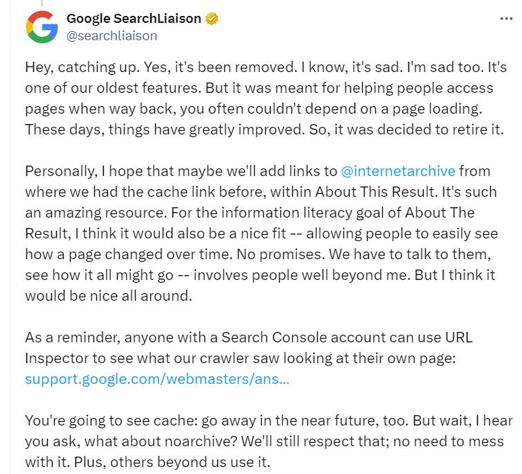

# Google Cache Link Viewer

Google always takes some useful services offline. I built a small tool to help access cached links. I hope it can help some people.

Google Cache Link Viewer is a simple little tool that helps you access Google cached links。

* [Live Demo](https://www.strerr.com/en/google-cache-viewer.html)

## Google Search’s cache links are officially being retired

Google has removed links to page caches from its search results page, the company’s search liaison [Danny Sullivan has confirmed](https://twitter.com/searchliaison/status/1753156161509916873). “It was meant for helping people access pages when way back, you often couldn’t depend on a page loading,” Sullivan wrote on X. “These days, things have greatly improved. So, it was decided to retire it.”

    

## How to access Google search web cache links now?

* Using `cache:` search operators, but this feature will be removed in the near future
* Direct access to Google cached links: `https://webcache.googleusercontent.com/search?q=cache:<your url>&hl=en-us&gl=us`, this feature will be removed in the near future
* Use [Archive.org](https://archive.org/) instead
* 

